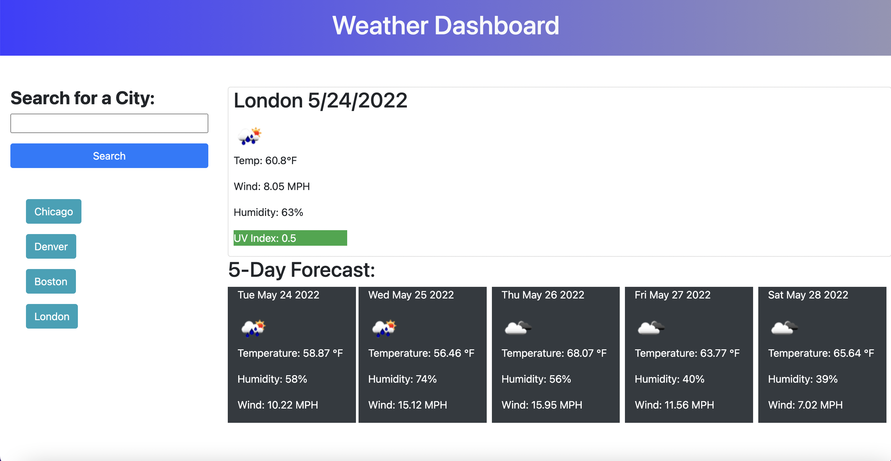

# weatherDashboard

For this assignment I was given the task to create a weather Dashboard.

If you can to find the weather outlook for multiple cities you can come to this page. When you arrive to the homepage you are shown an input field for you to type in the city. You will be presented with current weather conditions in the top box with the city name, date, icon, temperature, humidity, wind speed and the UV index. You will notice that the UV index is colored to alert you if conditions are favorable(green), moderate(yellow), and severe(red).

You will also see the five day weather forecast for that city below the current weather. You will see that the date, icon, temperature, wind speed and humidity are shown. 

When you search for a city, a button will appear beneath the input field with the name of the city you searched. You can click on the button and see the current and future weather conditions for that city. 

# Resources
- [OpenWeather One Call API](https://openweathermap.org/api/one-call-api)

# Links 

Here is the link to my github page: https://eliamart.github.io/weatherDashboard/